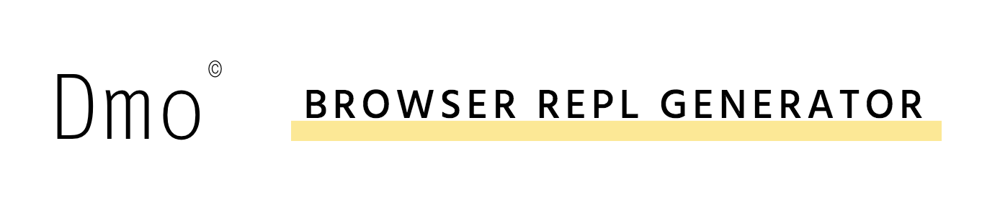
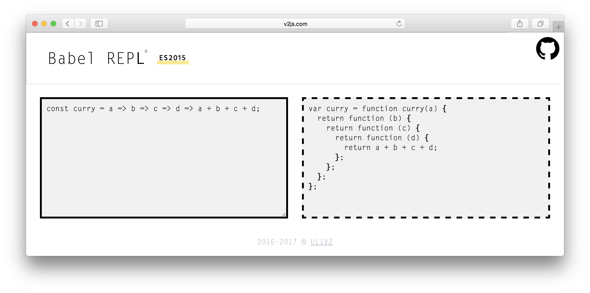
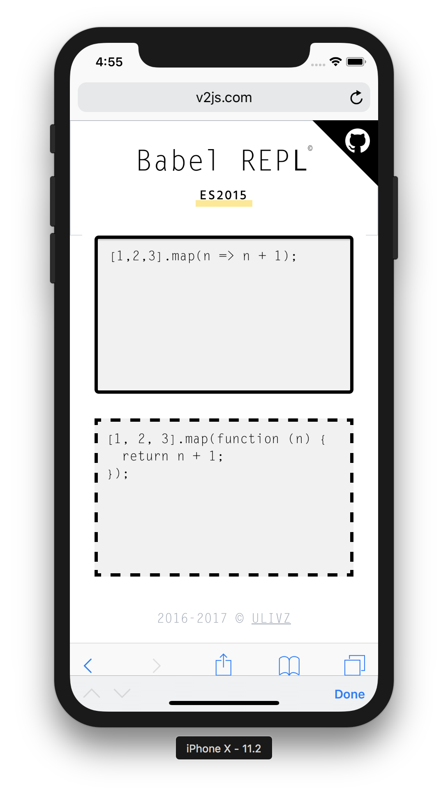

<p align="center">
  <a href="#"></a>
</p>

<p align="center">
  <!-- <a href="https://circleci.com/gh/ulivz/dmo/tree/dev"></a>
  <a href="https://codecov.io/github/ulivz/dmo?branch=dev"></a> -->
  <a href="https://www.npmjs.com/package/dmo"></a>
  <a href="https://www.npmjs.com/package/dmo"></a>
  <a href="https://www.npmjs.com/package/dmo"></a>
</p>

# Quick Start

Let's use dmo to make a simple [Babel](http://babeljs.io/) REPL, first, write a simple html file, then inject the following necessary dependencies:

```html
<script src="https://unpkg.com/dmo"></script>
<script src="https://unpkg.com/@babel/standalone@7.0.0-beta.38/babel.min.js"></script>
```

Next, initialize it:

```js
  window.dmo({
    title: 'Babel REPL',
    transformers: {
      es2015: function (input) {
        return Babel.transform(input, { presets: ['es2015'] }).code;
      }
    }
  })
```

Open the browser, then you can get a usable Babel REPL:

<p align="center">
  
</p>

Of course, the default also supports the response:

<p align="center">
  
</p>

Check out the online [DEMO](http://www.v2js.com/dmo/)

## Install

The recommendation is to use the [unpkg](https://unpkg.com/dmo) directly, of course, you can also use npm/yarn to download it:

```bash
npm i dmo --save
# yarn add dmo
```

## API

### dmo(options)

#### options

- Type: `Object`
- Required: `true`

  fields of options are as follows
  
##### input

- Type: `string`
- Required: `true`

  REPL's input initial value. it also supports reading Github files as input, such as:
  
  ```js
  'https://github.com/vuejs/vue/blob/dev/src/core/index.js'  // Full path
  '$github/vuejs/vue/dev/src/core/index.js'                  // Short cut
   ```

##### title

- Type: `string`
- Required: `true`

  REPL's title.


##### username

- Type: `string`
- Required: `true`

  user name.

##### name

- Type: `string`
- Required: `false`

  Project's name.

##### placeholder

- Type: `string`
- Required: `false`
- Default: `Please enter your input`

  placeholder of the input area.
  

##### transformers

- Type: `{ [mode: string]: transformFn }`
- Required: `true`

  An plain object, the key is the name of the mode, the value is the transform function corresponding to the mode, note that the transform accepts a string of the current input area as input, and the return value will display in the preview area.


## TODO 

- Highlight


## Contributing

1. Fork it!
2. Create your feature branch: `git checkout -b my-new-feature`
3. Commit your changes: `git commit -am 'Add some feature'`
4. Push to the branch: `git push origin my-new-feature`
5. Submit a pull request :D


## Author

**dmo** © [ulivz](https://github.com/ULIVZ), Released under the [MIT](./LICENSE) License.<br>
Authored and maintained by ulivz with help from contributors ([list](https://github.com/ULIVZ/dmo/contributors)).

> [github.com/ulivz](https://github.com/ulivz) · GitHub [@ulivz](https://github.com/ULIVZ)
