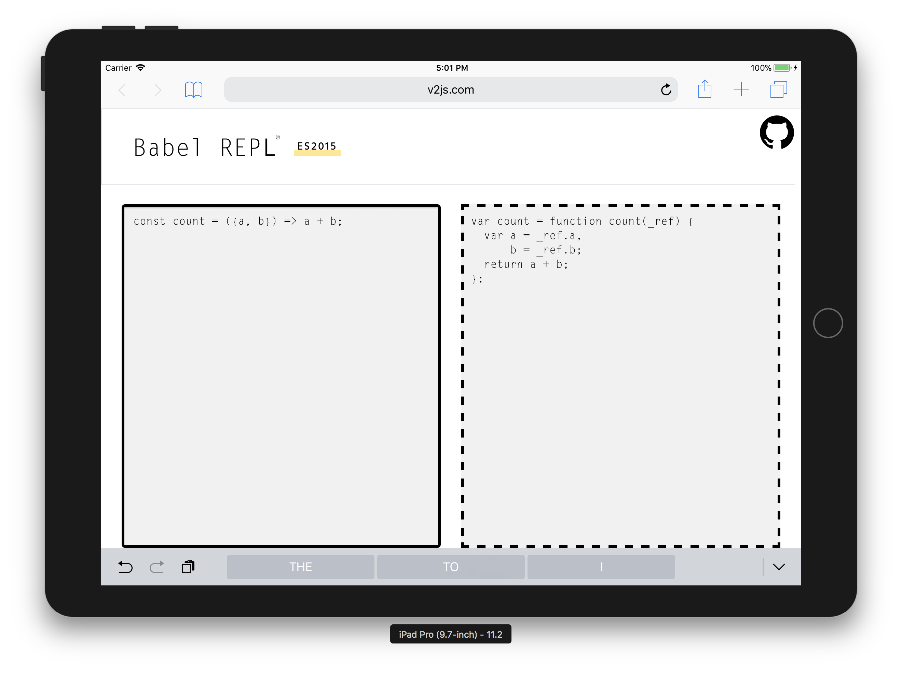

<p align="center">
  <a href="#"></a>
</p>

<p align="center">
  <a href="https://circleci.com/gh/ulivz/dmo/tree/dev"></a>
  <a href="https://codecov.io/github/ulivz/dmo?branch=dev"></a>
  <a href="https://www.npmjs.com/package/dmo"></a>
  <a href="https://www.npmjs.com/package/dmo"></a>
  <a href="https://www.npmjs.com/package/dmo"></a>
</p>

# Quick Start

Let's use dmo to make a simple babel, first, write a simple html file, then inject the following necessary dependencies:

```html
<script src="https://unpkg.com/dmo"></script>
<script src="https://unpkg.com/@babel/standalone@7.0.0-beta.38/babel.min.js"></script>
```

Next, initialize it:

```js
  window.dmo({
    title: 'Babel REPL',
    transformers: {
      es2015: function (input) {
        return Babel.transform(input, { presets: ['es2015'] }).code;
      }
    }
  })
```

Open the browser, then you can get a usable Babel REPL:

<p aligh="center">
  
</p>

Of course, the default also supports the response:

<p aligh="center">
  
  
</p>

## Build Setup

``` bash
# install dependencies
npm install

# serve with hot reload at localhost:8080
npm run dev

# build for production with minification
npm run build
```

For detailed explanation on how things work, consult the [docs for dmo-loader](http://dmojs.github.io/dmo-loader).
